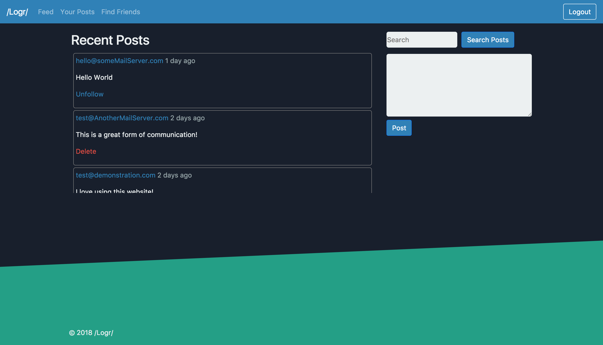

# /Logr/

/Logr/ is a social networking website that allows users to signup and post anything they like. Users can also find and follow other users to view more posts. 

## Goal

The purpose of this project was to demonstrate user signup/login functionality, creating posts and following users all of which is done through PHP and MySQL along with Ajax through jQuery.

## Built With

* [Bootstrap](https://getbootstrap.com/docs/4.0/getting-started/introduction/) - Front-end framework used
* [jQuery](http://api.jquery.com/) - JavaScript library used

